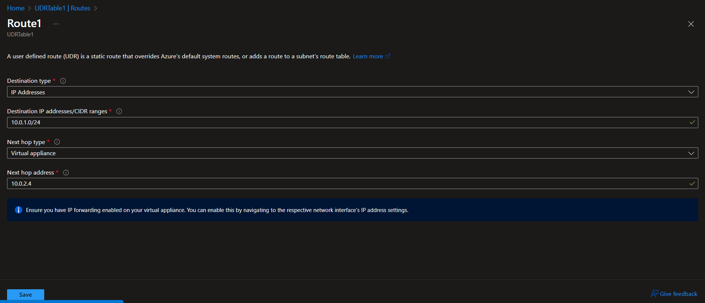

# Azure Networking Basics - User Defined Routes (UDR)

## The Architecture
- 3 Virtual Machines: appVM, dbVM, NVA
- 1 Virtual Network: VNet
- 3 Subnets: DB, Mgmt, App
- The VMs are deployed in the subnets as indicated below:
	appVM in App
	dbVM in DB
	NVA in Mgmt
- 1 Route Table attached to the App subnet, namely UDRTable1

## IP addressing
VNet - 10.0.0.0/16  
App subnet - 10.0.0.0/24  
DB subent - 10.0.1.0/24  
Mgmt subnet - 10.0.2.0/24  

appVM - 10.0.0.4  
dbVM - 10.0.1.4  
NVA - 10.0.2.4  

## Objective
All the traffic originating from the App subnet should travel through NVA in to their destinations. This is an example of how networks in enterprises may be set up, the NVA could be a firewall application which inspects the network traffic.

## Configuration
Created a routing rule called Route1 in the UDRTable1 that is attached to App subnet(10.0.0.0/24), with destination type set as 'IP Addresses', destination address/CIDR ranges set as the IP address and CIDR range of DB subnet which are 10.0.1.0/24. Next hop type is 'Virtual Appliance' and Next hop address '10.0.2.4' (IP address of the NVA). 
Enabled IP forwarding on the NIC of NVA, also enabled IP forwarding within the NVA's OS that is Windows Server Data Center 2012 by editing registry

## Testing
Connected to the appVM via SSH from my local PC and ran traceroute command for the dbVM `traceroute 10.0.1.4` and I could see the ICMP packet is being routed via the NVA to th  

## Learning
- Multiple routing layers exist (at Azure level and at the OS level). The UDR bypasses the Azure default routes and uses whatever route we define
- IP forwarding is disabled by default in Azure and Windows Server OS as a network security mechanism, as malicious users who have acess to a VM with IP forwarding enabled can create custom routes within the network for their advantage.
- UDRs apply to outbound traffic only, it does not affect inbound traffic arriving at the subnet
- Use of `route print1` command in Windows Server OS 

